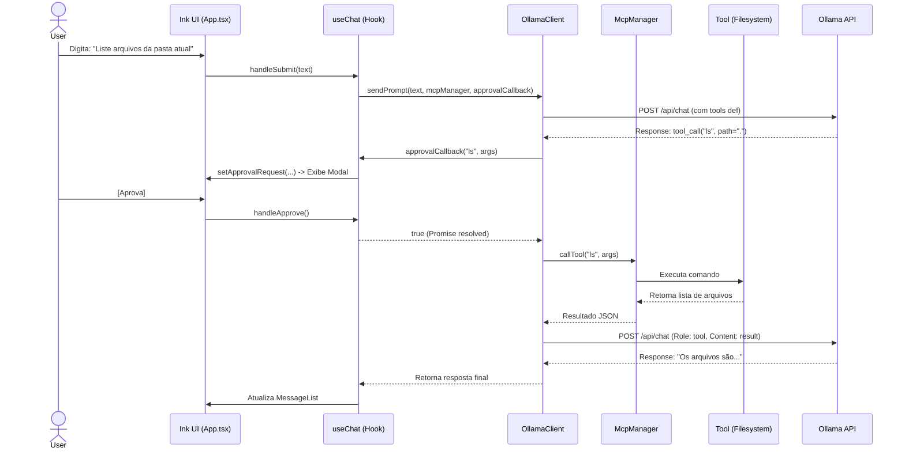

# Arquitetura do IA-Chat (CLI)

Este documento descreve a arquitetura atual do **IA-Chat**, que evoluiu para uma aplicação de linha de comando (CLI) robusta e interativa, construída com **TypeScript**, **React** e **Ink**.

## Visão Geral

O projeto abandonou a arquitetura Electron anterior em favor de uma CLI leve e focada em desenvolvedores, mantendo a capacidade de interagir com múltiplos modelos (Gemini, Copilot, Ollama) e executar ferramentas complexas via **Model Context Protocol (MCP)**. Um diferencial chave é o **Histórico Unificado**, que garante que o contexto da conversa seja preservado independentemente de qual provedor de IA você esteja usando.

### Stack Tecnológica

- **Runtime**: Node.js
- **UI Framework**: React + Ink (Renderização de componentes no terminal via Yoga Layout)
- **Bundler**: esbuild (Build rápido para ESM)
- **State Management**: React Hooks (`useChat`, `useCommands`) + Singleton Service Container
- **Protocolos**: MCP (Model Context Protocol), OAuth 2.0 (Copilot)

---

## Estrutura de Diretórios

A estrutura foi simplificada e dividida entre a interface (CLI) e o núcleo lógico (Boot):

- **`src/cli/`**: Camada de Apresentação e Aplicação.
    - `index.tsx`: Ponto de entrada. Inicializa o renderizador Ink.
    - `ui/`: Componentes React visuais (`App`, `MessageList`, `Input`, `ApprovalModal`).
    - `hooks/`: Lógica de estado e comandos (`useChat`, `useCommands`).
    - `commands/`: Implementação dos comandos (`/auth`, `/model`, `/clear`).
    - `services.ts`: **ServiceContainer** (Singleton) que injeta dependências do núcleo na UI.
- **`src/boot/`**: Camada de Domínio e Infraestrutura (Core).
    - `gemini-client.ts` / `copilot-client.ts` / `ollama-client.ts`: Clientes para cada LLM.
    - `mcp/`: Implementação do servidor e cliente MCP.
    - `services/`: Serviços auxiliares (ex: `OllamaToolService`).
    - `conversation-storage.ts`: Persistência local de chats (JSON).
    - `lib/`: Utilitários (Logger, IpcRouter legado).
- **`src/shared/`**: Tipos e constantes compartilhados.

---

## Componentes Chave

### 1. Service Container (`src/cli/services.ts`)

Atua como a ponte entre a UI (React) e a lógica de negócios (Classes). Implementa um padrão Singleton com injeção de dependência preguiçosa (Lazy Loading).

```typescript
// A UI consome os serviços globalmente via hooks ou downloads diretos
import { services } from '../services';

const gemini = services.gemini;
const mcp = services.mcpService;
```

### 2. Clients de IA (`src/boot/*-client.ts`)

Cada provedor (Gemini, Copilot, Ollama) possui uma classe dedicada que normaliza a interface de chat:

- **Gerenciamento de Histórico**: Mantém o contexto da conversa.
- **Integração MCP**: Mapeia ferramentas disponíveis para o formato específico do modelo.
- **Execução de Ferramentas**: Coordena a execução de tools aprovadas pelo usuário.
- **Unified Message Format**: Todos os clients aceitam `Message[]` como entrada e usam o `HistoryConverter` para adaptar para a API específica.

### 3. HistoryConverter (`src/boot/services/history-converter.ts`)

Componente crucial que normaliza as mensagens. Ele é responsável por traduzir o formato interno unificado (`Message[]`) para os formatos específicos de cada provedor (Google AI, OpenAI/Azure, Ollama), garantindo que tool calls e respostas sejam corretamente formatadas.

### 4. Model Context Protocol (MCP)

O suporte a MCP é central para a capacidade de agente do CLI.

- **`McpService`**: Identifica e carrega servidores MCP configurados.
- **`OllamaToolService`**: Converte definições de ferramentas MCP para o formato JSON Schema suportado pelo Ollama/Llama.
- **Loop de Execução**: O cliente detecta `tool_calls` na resposta do modelo, solicita aprovação via Callback, executa a ferramenta e devolve o resultado ao modelo.

---

## Fluxos de Dados

### 1. Fluxo de Chat com Ferramentas (Ex: Ollama)



### 2. Fluxo de Autenticação (Copilot)

A CLI lida com o fluxo OAuth Device Flow diretamente no terminal.

1.  Usuário digita `/auth`.
2.  `CopilotAuthService` solicita `user_code` à API do GitHub.
3.  CLI exibe o código e copia para a área de transferência da GUI (usando `clipboardy`).
4.  Serviço faz polling até que o usuário autorize no navegador.
5.  Token OAuth é salvo em `app-settings.json`.

---

## Build e Execução

O projeto é compilado para um único arquivo MJS executável via Node.js.

```bash
# Build (esbuild)
npm run build:cli

# Executar
npm run cli
```
