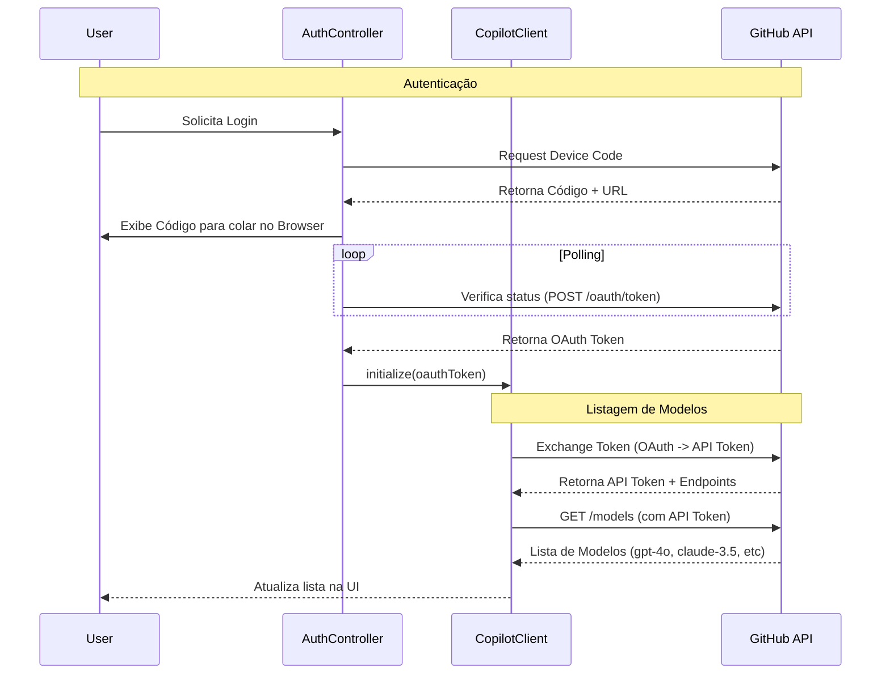
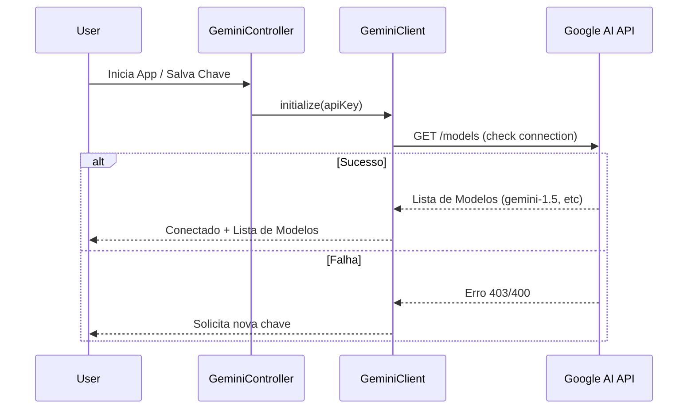
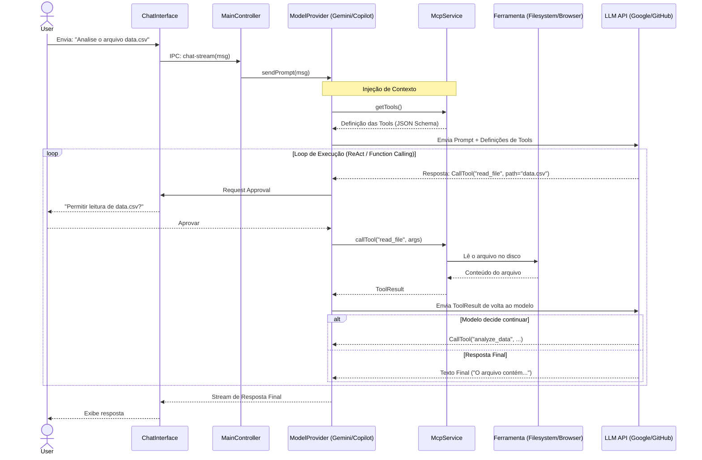

# Arquitetura do IA-Chat

Este documento descreve a arquitetura de alto nível do aplicativo **IA-Chat** e detalha os fluxos de dados para interações com múltiplos modelos (Gemini e Copilot) e o uso do Model Context Protocol (MCP).

## Visão Geral

O aplicativo é construído sobre o framework **Electron**, utilizando uma arquitetura de processos múltiplos com **TypeScript** em toda a stack:

*   **Processo Main (Node.js)**: Gerencia o ciclo de vida da aplicação, orquestra a comunicação entre serviços (Gemini, Copilot, MCP) e mantém o estado da aplicação. Foi refatorado para utilizar o padrão **Controller-Service**.
*   **Processo Renderer (React + Vite)**: Interface do usuário moderna e responsiva. Comunica-se com o Main exclusivamente através de um **IPC Bridge** tipado.

### Componentes Chave (Main Process)

A arquitetura do processo Main foi modularizada para melhor escalabilidade:

*   **`src/boot/main.ts`**: Ponto de entrada. Inicializa serviços e injeta dependências nos controladores.
*   **`src/boot/lib/IpcRouter.ts`**: Roteador central que despacha mensagens IPC para os handlers registrados.
*   **Controladores (`src/boot/controllers/`)**:
    *   **`GeminiController`**: Gerencia interações com a API do Google Gemini.
    *   **`AuthController`**: Gerencia autenticação OAuth (Copilot) e tokens.
    *   **`McpController`**: Gerencia configuração e testes de servidores MCP.
*   **Serviços de Domínio**:
    *   **`src/boot/gemini-client.ts`**: Cliente para o Google Generative AI SDK.
    *   **`src/boot/copilot-client.ts`**: Cliente reverso para a API interna do GitHub Copilot (Token Exchange, Chat).
    *   **`src/boot/mcp/McpService.ts`**: Serviço central para gerenciamento de conexões MCP (substitui o antigo `mcp-manager`).
*   **`src/boot/conversation-storage.ts`**: Persistência de dados local (arquivos JSON).

---

## Fluxos de Execução

## Fluxos de Execução

### 1. Inicialização e Autenticação

Como cada provedor lida com a conexão inicial e listagem de modelos.

#### A. GitHub Copilot (OAuth + Token Exchange)
Fluxo complexo que envolve autorização no navegador e troca de tokens para acesso à API interna.



#### B. Google Gemini (API Key)
Fluxo simplificado baseada em chave de API (arquivo `.env` ou Input do usuário).



### 2. Fluxo de Chat Genérico (com MCP)

Tanto o Gemini quanto o Copilot compartilham a **mesma arquitetura** para processamento de chat e uso de ferramentas (MCP). O **ChatProvider** serve como uma abstração para qualquer modelo.



## Estrutura de Diretórios Atualizada

*   `src/boot/`: Código do Processo Main (Electron/Node).
    *   `controllers/`: Lógica de orquestração IPC.
    *   `mcp/`: Implementação do Model Context Protocol.
    *   `lib/`: Utilitários (Router, etc).
*   `src/renderer/`: Código do Processo Renderer (React).
    *   `providers/`: Abstrações para diferentes modelos (Gemini/Copilot).
    *   `components/`: Componentes da UI.
*   `release/`: Artefatos de build (.AppImage, .exe).
*   `logos/`: Assets de marca.

## Build e Distribuição

O projeto utiliza `electron-builder` para gerar executáveis portáteis.

*   **Linux**: Gera `.AppImage` (Requer `libfuse2` em distros novas).
*   **Windows**: Gera `.exe` (Pode ser cross-compiled no Linux via Wine).

Para construir:
```bash
npm run dist
```
