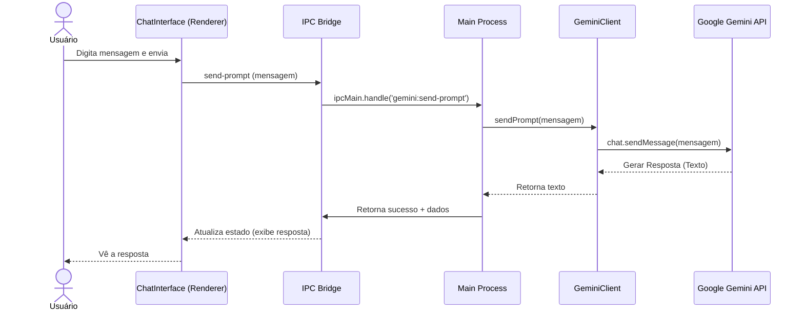
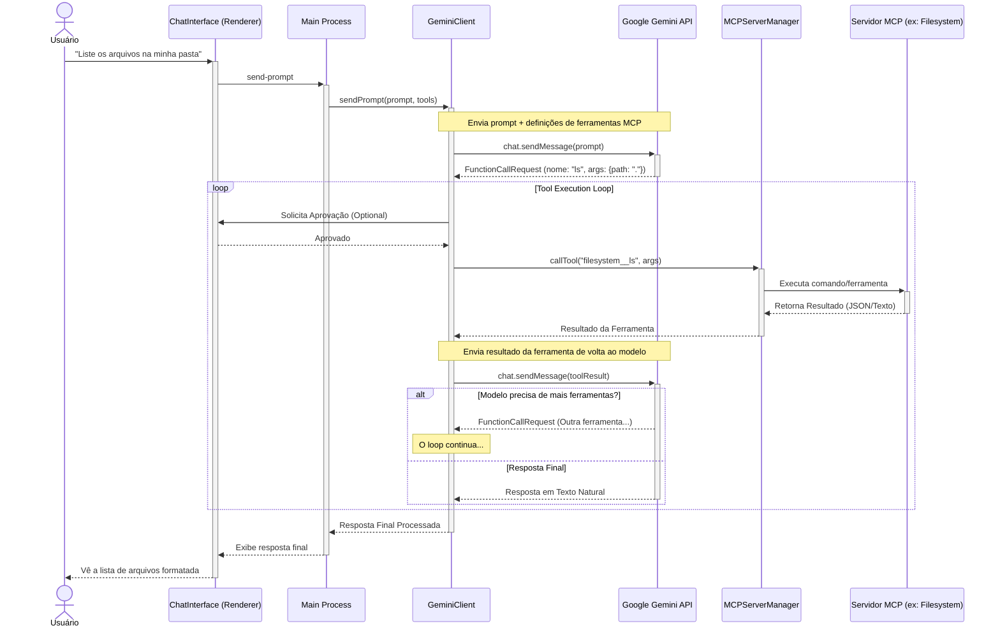

# Arquitetura do Gemini Desktop

Este documento descreve a arquitetura de alto nível do aplicativo **Gemini Desktop** e detalha os fluxos de dados para interações de chat padrão e interações envolvendo o Model Context Protocol (MCP).

## Visão Geral

O aplicativo é construído sobre o framework **Electron**, utilizando uma arquitetura de processos múltiplos:

*   **Processo Main (Node.js)**: Gerencia o ciclo de vida da aplicação, interações com o sistema operacional, persistência de dados (armazenamento de conversas), e orquestra as comunicações com a API do Gemini e servidores MCP.
*   **Processo Renderer (React + Vite)**: Responsável pela interface do usuário (UI), exibindo o chat, histórico e painel de controle MCP. A comunicação com o processo Main ocorre via **IPC** (Inter-Process Communication).

### Componentes Chave

*   **`src/boot/main.js`**: Ponto de entrada do processo Main. Configura os handlers IPC.
*   **`src/boot/gemini-client.js`**: Wrapper em torno do Google Generative AI SDK. Gerencia sessões de chat e o loop de execução de ferramentas.
*   **`src/boot/mcp-manager.js`**: Gerencia conexões com servidores MCP, descoberta de ferramentas/recursos e execução de chamadas.
*   **`src/renderer/components/ChatInterface.tsx`**: Componente principal da UI de chat.

---

## Fluxos de Execução

### 1. Fluxo de Chat Padrão (Sem Ferramentas)

Este é o fluxo básico quando o usuário envia uma mensagem e o modelo responde apenas com seu conhecimento interno.

### 2. Fluxo de Chat com MCP (Tool Use)

Este fluxo ocorre quando o Gemini decide que precisa usar uma ferramenta (ex: listar arquivos, ler recursos) para responder à solicitação do usuário. O aplicativo implementa um "loop de execução" para processar chamadas de função sequencialmente.

## Estrutura de Diretórios Importante

*   `.gemini/`: Armazena configurações globais e logs.
*   `src/conversation-storage`: Persistência de histórico de chat (arquivos JSON locais).
*   `src/boot/`: Lógica do lado do servidor (Main Process).
*   `src/renderer/`: Código da aplicação React.

## Visualização

Para visualizar os diagramas acima graficamente, você pode copiar o código dos blocos `mermaid` e colar no [Mermaid Live Editor](https://mermaid.live).
